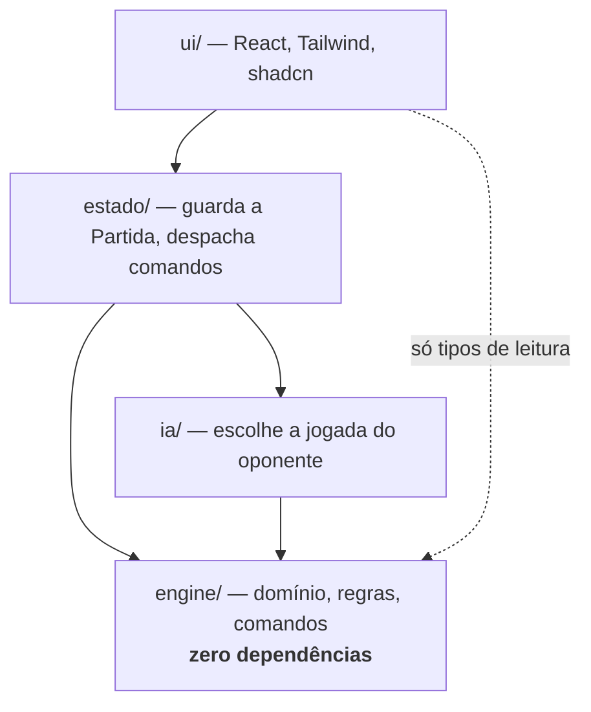

# Arquitetura

> Status: **rascunho anotado** — 13 pendências na seção 8
> Deriva de: [domain.md](domain.md) · [requirements.md](requirements.md) · [vision.md](vision.md)
> Última atualização: 2026-07-29

## Como ler este documento

O `domain.md` disse **o que** existe. Este documento diz **onde cada coisa mora e quem pode
falar com quem**.

Toda decisão aqui serve a um requisito ou a uma decisão de modelagem já tomada, citada ao
lado. Arquitetura sem requisito que a justifique é preferência pessoal disfarçada.

Pendências: **An**. Marcação: `[D]` decidido, `[P]` proposto com `⚠️ An`.

---

## 1. Camadas e a regra de dependência



- `[P]` ⚠️ **A1** — Quatro camadas, e as setas só apontam para dentro. `engine/` é o
  centro e **não conhece ninguém**.

| Camada | Responsabilidade | Pode importar |
|---|---|---|
| `engine/` | Domínio, regras, comandos, consultas | **Nada** — nem React, nem DOM, nem bibliotecas de UI (RNF1.1) |
| `ia/` | Escolher a jogada do oponente | Só `engine/` |
| `estado/` | Guardar a `Partida` atual, despachar comandos, acionar a IA na vez dela | `engine/` e `ia/` |
| `ui/` | Renderizar e capturar interação | `estado/`, e tipos de leitura de `engine/` |

- `[P]` ⚠️ **A2** — A regra de dependência é **verificada por ESLint**
  (`no-restricted-imports` por diretório), não por disciplina. Uma violação quebra o CI.

> A2 é o ponto que separa arquitetura documentada de arquitetura real. "A engine não importa
> React" escrito num documento sobrevive até a primeira pressa. A mesma frase como regra de
> lint sobrevive para sempre. Sempre que uma restrição arquitetural puder ser automatizada,
> ela deve ser — caso contrário ela é uma intenção, não uma fronteira.

- `[P]` ⚠️ **A3** — `ia/` **nunca** importa de `estado/` nem de `ui/`. A IA é uma
  função de decisão, não um participante do ciclo de renderização. Isso a torna testável sem
  React e executável no futuro em worker, servidor ou aplicativo nativo.

---

## 2. As três fronteiras que o domínio impôs

### 2.1 Engine ↔ IA — visão parcial (M11, M12, RF5.2)

A IA recebe `VisaoDoJogador` e **nunca** `Partida`. Não é convenção: é o tipo que ela aceita.

```
ia.escolherJogada(visao: VisaoDoJogador) → Comando
```

Se a assinatura não recebe `Partida`, a IA não tem como ler o monte nem os mortos. A garantia
é o sistema de tipos, não a boa-fé de quem escreve.

### 2.2 Engine ↔ Interface — movimentos válidos (M10, RF2.1)

```
engine.movimentosValidos(visao: VisaoDoJogador) → Comando[]
```

A interface renderiza o que está nessa lista. Jogada inválida não é recusada com mensagem:
**ela não aparece**. A mesma função alimenta a IA (2.1) e os testes.

- `[P]` ⚠️ **A4** — Interface e IA consomem **exatamente a mesma API**:
  `VisaoDoJogador` + `movimentosValidos`. Nenhuma das duas tem acesso privilegiado.

> A4 tem uma consequência que vale explicitar: **a IA joga com as mesmas informações e as
> mesmas opções que o humano**. Não é uma promessa de comportamento, é uma propriedade da
> estrutura. E dá um teste barato: se a IA consegue jogar uma partida inteira, a API que a
> interface usa está completa.

### 2.3 Aleatoriedade injetada (RNF1.3)

- `[P]` ⚠️ **A5** — A engine **nunca** chama `Math.random()` nem `Date.now()`. Existe
  uma interface `Aleatorio`, implementada por um PRNG com semente, injetada ao iniciar a
  partida:

```
engine.iniciarPartida(semente: number) → Partida
```

A semente fica **dentro** da `Partida` (M7), então uma partida é integralmente descrita por
`(semente, comandos[])`. É o que entrega testes reproduzíveis, replay e a base técnica de um
futuro multiplayer.

---

## 3. Onde vive o estado de aplicação

A `Partida` é imutável e os comandos são funções puras (M8). Algo precisa guardar a partida
atual e disparar re-renderização. Três alternativas:

| Alternativa | A favor | Contra |
|---|---|---|
| **`useReducer` + Context** | A engine **já é um reducer** — `(estado, comando) → estado`. Encaixe 1:1, sem adaptador. Nenhuma dependência nova | Context re-renderiza todos os consumidores |
| **Zustand** | Seleção granular, evita re-render em cascata, testável fora do React | Dependência nova para um problema que ainda não temos |
| **TanStack Store** | Coerência com o resto da stack | Mesmo ponto do Zustand, com menos maturidade |

- `[P]` ⚠️ **A6** — **`useReducer` + Context.** A engine já expõe exatamente a forma
  de um reducer; qualquer outra opção adiciona um adaptador para nada.

> O risco real do Context é re-render em cascata. Duas razões para aceitá-lo agora: o jogo
> tem **uma tela com um estado**, não dezenas de assinantes independentes; e se virar
> problema, trocar por Zustand é uma mudança **contida em `estado/`** — porque a engine é
> pura e não sabe quem a chama. Uma decisão fácil de reverter não merece ser antecipada.

---

## 4. Estrutura de pastas

- `[P]` ⚠️ **A7** — A estrutura abaixo materializa as camadas. Cada pasta de primeiro
  nível dentro de `src/` é uma camada da §1.

```
src/
  engine/
    dominio/        Carta, Jogo, Partida, Value Objects (domain.md §2–3)
    regras/         validação de sequências, classificação, pontuação
    comandos/       os seis comandos — aplicar(partida, comando)
    consultas/      movimentosValidos, VisaoDoJogador
    aleatorio/      interface Aleatorio + PRNG com semente
    index.ts        API pública — o resto é privado
  ia/
  estado/
  ui/
    componentes/
    rotas/
  main.tsx

tests/
  integracao/       partidas completas, invariante de conservação (M9)
  e2e/              Playwright — Onda 3
```

- `[P]` ⚠️ **A8** — A engine expõe uma **API pública única** em `engine/index.ts`.
  Nada fora de `engine/` importa de subpastas internas. Isso permite reorganizar o interior
  da engine sem tocar em nenhum consumidor.

- `[P]` ⚠️ **A9** — **Testes unitários ficam ao lado do código** (`sequencia.test.ts`
  junto de `sequencia.ts`). Só integração e E2E ficam em `tests/`.

> A9 **divergindo do combinado.** A estrutura que você definiu no início prevê `tests/` para
> todos os testes. Proponho mudar para unitários colocados, por um motivo específico deste
> projeto: cada teste da engine cita um `Rn` de `rules.md` (RNF2.1). Quando uma regra muda,
> é preciso achar o código **e** o teste. Colocados, aparecem no mesmo diretório e é difícil
> alterar um esquecendo o outro. Separados, a distância convida ao esquecimento.
>
> Se você preferir manter tudo em `tests/`, é uma escolha legítima — só quero que seja
> escolha, não inércia.

---

## 5. O que não vamos construir

- `[P]` ⚠️ **A10** — **Não existe camada de persistência na v1**, nem uma interface
  vazia à espera dela.

> A RNF1.2 exige que o estado seja **serializável** — não que exista persistência. São coisas
> diferentes, e confundi-las produz a abstração especulativa mais comum em projeto novo: uma
> interface `Repositorio` com uma implementação em memória, esperando o dia do banco.
>
> `Partida` ser dado puro (M8) já satisfaz a RNF1.2 por completo. `JSON.stringify(partida)`
> funciona hoje. Quando houver persistência, ela será escrita contra um caso real — que é a
> única forma de acertar a interface.

Multiplayer, contas, duplas e outras variantes seguem fora de escopo ([vision.md §4](vision.md)).

---

## 6. Decisões pendentes sobre a stack

Três itens da stack original que precisam de decisão formal. Cada um vira ADR se confirmado.

### 6.1 TanStack Query — remover

- `[P]` ⚠️ **A11** — **Remover o TanStack Query da stack.**

O TanStack Query resolve cache, revalidação e sincronização de **estado de servidor**. A
RNF4.1 estabelece que não há backend, banco nem contas. Não existe estado de servidor para
gerenciar — logo, ele não tem problema para resolver.

Manter uma biblioteca "por precaução" custa: peso no bundle, uma abstração que alguém vai
tentar usar para estado local, e uma decisão nunca examinada. Se houver multiplayer no
futuro, ele volta — e o ADR que registra esta remoção será exatamente o contexto que a
decisão futura precisa.

### 6.2 TanStack Router — manter

- `[P]` ⚠️ **A12** — **Manter o TanStack Router.**

Este eu levantei como suspeito no primeiro dia e mudei de opinião ao escrever os requisitos.
Três razões concretas:

- São **quatro telas**, não duas: inicial (RF1.2), partida, fim de partida (RF1.5) e uma tela
  de regras — que num jogo com 65 regras é conteúdo de verdade, não enfeite.
- A RF1.3 (abandonar partida com confirmação) e a RF1.4 (avisar antes de sair) são
  exatamente **bloqueio de navegação**. O router resolve isso; sem ele, seria código manual
  em dois lugares.
- Adicionar router depois custa reescrever a navegação inteira. É a decisão menos reversível
  das três.

Registro a honestidade: é a justificativa mais fraca da stack. Se você preferir dois estados
e nenhuma rota, funciona — mas então a RF1.3 e a RF1.4 passam a ser trabalho manual.

### 6.3 Playwright — adiar para a Onda 3

- `[P]` ⚠️ **A13** — **Playwright entra na Onda 3**, não agora.

E2E é o teste mais caro de escrever e manter, e o mais lento. Com a engine pura e coberta
regra por regra em Vitest (RNF2.1), o Playwright cobre pouco que os testes de engine já não
cubram — no começo, ele testaria uma interface que ainda não existe.

O momento certo é quando houver uma partida jogável de ponta a ponta: aí um único teste E2E
que joga uma partida inteira passa a valer muito.

---

## 7. Onde Clean Architecture se aplica — e onde não

A regra de dependência da §1 é o núcleo de Clean Architecture: **dependências apontam para o
domínio**. `engine/` é domínio e casos de uso; `ia/`, `estado/` e `ui/` são adaptadores.

O que **não** vamos importar de Clean Architecture:

- **Sem interfaces de repositório** — não há persistência (A10)
- **Sem camada de serviços de aplicação** — os seis comandos da engine já são os casos de uso
- **Sem DTOs entre camadas** — `VisaoDoJogador` já é a projeção; um DTO em cima seria tradução sem tradutor

> Clean Architecture é um conjunto de soluções para problemas de acoplamento. Aplicar as
> soluções sem ter os problemas produz cerimônia. Estamos usando a parte que resolve algo
> nosso — a regra de dependência, que protege a RNF1.1 e a RF5.2 — e deixando o resto.

---

## 8. Pendências

| # | Assunto | Proposta |
|---|---|---|
| **A1** | Camadas | Quatro camadas; setas só para dentro; `engine/` no centro |
| **A2** | Fronteira | Regra de dependência **verificada por ESLint**, não por disciplina |
| **A3** | IA | `ia/` nunca importa de `estado/` nem de `ui/` |
| **A4** | API | Interface e IA consomem a **mesma** API, sem privilégio |
| **A5** | Aleatoriedade | Interface `Aleatorio` injetada; semente dentro da `Partida` |
| **A6** | Estado | `useReducer` + Context, não Zustand |
| **A7** | Pastas | Estrutura de `src/` espelhando as camadas |
| **A8** | Encapsulamento | API pública única em `engine/index.ts` |
| **A9** | Testes | **Unitários ao lado do código** — diverge da estrutura combinada |
| **A10** | Persistência | **Nenhuma camada**, nem interface vazia |
| **A11** | Stack | **Remover TanStack Query** → ADR |
| **A12** | Stack | **Manter TanStack Router** → ADR |
| **A13** | Stack | **Playwright na Onda 3** → ADR |

### As que merecem sua atenção

- **A9** — é a única que **contraria** algo que você definiu. Quero que seja decisão sua.
- **A11 e A12** — mexem na stack que você escolheu. A primeira remove, a segunda mantém algo que eu mesmo tinha questionado.
- **A6** — a mais fácil de reverter, e por isso a que menos merece discussão longa.
