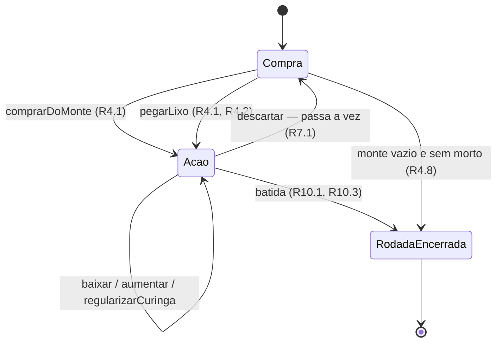

# Modelo de domínio

> Status: **confirmado** — 12 decisões de modelagem, nenhuma pendência
> Pronto para servir de base ao `architecture.md` e aos testes da engine
> Deriva de: [rules.md](rules.md) · [requirements.md](requirements.md) · [glossary.md](glossary.md)
> Última atualização: 2026-07-29

## Como ler este documento

Este documento traduz as 65 regras de `rules.md` em **estrutura**. Não introduz regra nova:
toda afirmação sobre comportamento cita o `Rn` de onde vem. Se algo aqui não tem citação, é
decisão de modelagem — e essas vêm marcadas.

Ainda não é código. É o desenho que o código vai seguir, e o vocabulário é o do
[glossary.md](glossary.md).

Identificadores de pendência: **Mn**. Mesma marcação de origem dos outros documentos, com
uma marca nova:

| Marca | Significado |
|---|---|
| `[R]` | Decorre diretamente de uma regra, citada ao lado |
| `[D]` | Decisão de modelagem confirmada |
| `[P]` | Decisão de modelagem proposta, não confirmada — acompanhada de `⚠️ Mn` |

Não resta nenhuma `[P]`. O histórico das 12 decisões está na seção 8.

---

## 1. As três perguntas espinhosas

### 1.1 `Carta` tem identidade?

Existem **dois 8♥** no baralho (R1.2). São a mesma coisa ou coisas diferentes?

Para as *regras*, são intercambiáveis: qualquer 8♥ serve na mesma posição. Isso sugere um
Value Object. Mas três necessidades pedem identidade:

- **O lixo é uma pilha ordenada** e totalmente visível (R4.3). Sem identidade, dois 8♥ na
  pilha são indistinguíveis, e "esta carta veio da mão dele no turno passado" deixa de ser
  representável.
- **A interface precisa de chave estável.** Duas cartas idênticas na mão são dois elementos
  distintos na tela; sem `id`, animações e reconciliação de lista quebram.
- **Serialização e replay** (RNF1.2, RNF1.3) ficam ambíguos sem identidade.

- `[D]` `Carta` é uma **Entity imutável**: tem `id` que identifica a carta
  física, além de `naipe` e `valor`. As **regras comparam apenas `naipe` e `valor`**; o `id`
  serve para rastreio, interface e serialização.

> A lição de DDD aqui é que a pergunta "Value Object ou Entity?" não se responde olhando o
> conceito, e sim **o que o sistema precisa fazer com ele**. Uma carta de baralho é
> intercambiável numa mesa de verdade porque a mesa não precisa rastreá-la. Nosso sistema
> precisa.

### 1.2 "Ser curinga" não é propriedade da carta

R1.3 diz que um 2 na sua posição natural **é carta natural**. R6.5 diz que um curinga
baixado pode **deixar de ser curinga** sem sair do jogo.

Portanto "curinga" não é um atributo de `Carta`. É um **papel que a carta exerce dentro de
uma sequência**. Modelar como propriedade da carta envenenaria o validador inteiro e tornaria
a R6.5 inexprimível.

- `[D]` Uma `Sequencia` não é uma lista de cartas, e sim uma lista de
  **posições**. Cada posição é uma de duas formas:

| Forma | Conteúdo | Significado |
|---|---|---|
| `Natural` | `carta` | A carta ocupa sua própria casa |
| `Curinga` | `carta`, `representa: ValorDeCarta` | A carta faz papel de outra |

Consequências que caem de graça:

- **Categoria da canastra** (R8.2, R8.5) é `LIMPA` se e somente se nenhuma posição é
  `Curinga`. Função derivada de uma linha, nunca campo armazenado.
- **Regularizar o curinga** (R6.5) é converter uma posição `Curinga` em `Natural`. A regra
  vira uma transformação nomeada, não um caso especial espalhado.
- **Curinga de outro naipe é permanentemente sujo** (R6.5) porque a conversão exige que
  `carta.naipe` seja igual ao naipe da sequência. A impossibilidade é estrutural, não uma
  verificação extra.

### 1.3 A máquina de estados do turno

R3.1 dá três fases, R7.3 dá **duas terminações**, e R9.4 encaixa "pegar morto" no meio.



Três coisas que o diagrama deixa explícitas e a prosa esconderia:

- **`Compra` não aceita `baixar`.** R3.2 proibiu baixar antes de comprar; aqui isso é a
  ausência de uma aresta, não uma validação.
- **`Acao` tem laço próprio.** R3.3 permite quantas descidas e aumentos o jogador quiser.
- **Existem duas saídas para `RodadaEncerrada`**, e uma delas parte de `Compra` — o caso da
  R4.8, que é fácil de esquecer.

- `[D]` **Pegar o morto não é fase nem comando.** É um **efeito
  automático**: sempre que a mão de um jogador zera e há morto disponível, a engine o entrega
  (R9.2, R9.4). O jogador nunca "pede" o morto.
- `[D]` **Bater também é automático.** O jogador escolhe uma jogada
  (baixar, aumentar ou descartar); se ela zera a mão, não há morto disponível e as condições
  da R10.1 estão satisfeitas, a batida acontece. Não existe comando `bater`.

> M3 e M4 reduzem a superfície de comandos da engine de oito para seis. Menos comandos
> significa menos caminhos para testar e menos formas de a interface errar. Vale notar que
> `glossary.md` lista `pegarMorto` e `bater` como ações — continuam sendo *termos do
> domínio*, mas são **operações internas**, não comandos do jogador. Vou registrar essa
> distinção no glossário.

---

## 2. Value Objects

Imutáveis, sem identidade, comparados por valor.

| Tipo | Definição | Origem |
|---|---|---|
| `Naipe` | `Copas \| Ouros \| Espadas \| Paus` | R1.2 |
| `Valor` | `A \| 2 … 10 \| J \| Q \| K` | R1.2 |
| `ValorDeCarta` | `{ naipe, valor }` — o que as regras comparam | R1.2 |
| `PosicaoSequencia` | `Natural \| Curinga` (ver M2) | R1.3, R6.5 |
| `CategoriaCanastra` | `DE_1000 \| DE_500 \| LIMPA \| SUJA` | R8.2 |
| `FaseDoTurno` | `Compra \| Acao` | R3.1 |
| `Pontuacao` | Detalhamento por componente, não só total | R11, RF4.2 |

- `[D]` `Pontuacao` é um objeto com um campo por componente da R11
  (canastras, cartas na mesa, cartas na mão, bônus de batida, penalidade de morto), não um
  número. O total é derivado. RF4.2 exige mostrar a apuração item por item, e um único
  número tornaria a regra mais complexa do sistema impossível de auditar.

---

## 3. Entidades

| Entidade | Campos | Invariantes |
|---|---|---|
| `Carta` | `id`, `naipe`, `valor` | Imutável (M1) |
| `Jogo` | `id`, `dono`, `naipe`, `posicoes[]` | Ver §4 |
| `Morto` | `id`, `cartas[]`, `reclamadoPor` | 11 cartas (R2.3); sem dono até ser reclamado |
| `Jogador` | `id`, `mao[]`, `jogos[]`, `mortosPegos` | `mortosPegos` ∈ {0, 1, 2} (R9.3) |
| `Partida` | ver §5 | Raiz do agregado |

---

## 4. Invariantes de `Jogo`

Este é o coração do domínio. Toda regra abaixo é verificada na construção — **um `Jogo`
inválido não deve ser representável**.

| # | Invariante | Regra |
|---|---|---|
| I1 | Entre 3 e 14 posições | R5.1, R5.3 |
| I2 | Toda posição `Natural` tem `carta.naipe` igual ao naipe do jogo | R5.1 |
| I3 | Valores consecutivos e ascendentes | R5.1 |
| I4 | No máximo **uma** posição `Curinga` | R1.4, R5.4 |
| I5 | Sem valores repetidos, exceto os dois Ases de uma sequência de 14 | R5.6 |
| I6 | A sequência não passa do Ás alto — `K-A-2` é inválida | R5.3 |
| I7 | Posição `Curinga` só com carta de valor `2` | R1.3 |

Funções derivadas, nunca campos:

- `tamanho` = número de posições
- `ehCanastra` = `tamanho >= 7` (R8.1)
- `categoria` = precedência `DE_1000 → DE_500 → LIMPA → SUJA` (R8.3)
- `contaComoLimpaParaBatida` (R10.2)

- `[D]` A construção de `Jogo` é feita por uma função que retorna
  **sucesso com o jogo, ou a lista de invariantes violadas**. Não existe construtor que
  produza um `Jogo` inválido, e não existe `Jogo` "a validar depois".

> I6 merece atenção. A ordem `A,2,…,K,A` (R5.2) não é uma ordem circular: é uma **sequência
> linear de 14 casas** em que o Ás aparece na primeira e na última. Tratar como circular
> permitiria `K-A-2`, que a R5.3 proíbe. É um erro fácil de cometer e difícil de notar.

---

## 5. Agregado e raiz

- `[D]` Existe **um único agregado**, com raiz em `Partida`. Todo o estado
  da partida é alcançável a partir dela, e nada de fora a modifica diretamente.

```
Partida
  semente               Aleatoriedade determinística (RNF1.3)
  jogadores[2]          mao, jogos, mortosPegos
  monte[]               oculto; só a contagem é pública (RF3.3)
  lixo[]                pilha ordenada, integralmente pública (R4.3, RF3.1)
  mortos[2]             ocultos; contagem de não reclamados é pública (RF3.4)
  jogadorDaVez
  fase                  Compra | Acao (R3.1)
  placar                acumulado por jogador (R12.1)
  numeroDaRodada
```

- `[D]` `Partida` é **imutável**. Comandos são funções puras:
  `aplicar(partida, comando) → Sucesso(nova partida, eventos[]) | Recusa(motivo)`.

> M8 é o que entrega três requisitos ao mesmo tempo. Estado imutável torna a engine
> serializável (RNF1.2), determinística e testável (RNF1.3) — um teste é uma asserção sobre
> o valor de retorno, sem preparação nem limpeza. E torna a engine independente de framework
> (RNF1.1) de forma natural: uma função pura não tem como depender do React.

Um único invariante de agregado, e ele é conservativo:

- `[D]` **Conservação das cartas.** A soma de todas as cartas em mãos,
  jogos, monte, lixo e mortos é sempre exatamente **104**, sem repetição de `id`. Toda
  transição preserva isso.

> M9 é o teste mais valioso que a engine vai ter. Ele não verifica uma regra específica —
> verifica que **nenhuma** operação inventou ou perdeu carta. Um único teste que roda após
> cada transição pega uma classe inteira de bugs que testes por regra deixariam passar.

---

## 6. Comandos e movimentos válidos

Seis comandos, decorrentes de M3 e M4:

| Comando | Fase | Regra |
|---|---|---|
| `comprarDoMonte` | `Compra` | R4.1 |
| `pegarLixo` | `Compra` | R4.1, R4.2, R4.4 |
| `baixar` | `Acao` | R6.1 |
| `aumentar` | `Acao` | R6.2, R6.3 |
| `regularizarCuringa` | `Acao` | R6.5, R6.6 |
| `descartar` | `Acao` | R7.1, R7.2 |

- `[D]` A engine expõe `movimentosValidos(partida) → Comando[]`, que
  enumera **todos** os comandos legais no estado atual.

> M10 é a peça de desenho mais importante deste documento, porque **um único mecanismo
> atende três necessidades distintas**:
>
> - **RF2.1** — a interface só mostra o que está nessa lista. Jogada inválida não é recusada
>   com mensagem: ela não aparece.
> - **RF5.2** — a IA escolhe *dentro* dessa lista. Ela não precisa reimplementar as regras,
>   e portanto não pode divergir delas.
> - **Testes** — a lista de movimentos válidos num estado é uma asserção direta e legível
>   sobre o que as regras permitem.
>
> Sem `movimentosValidos`, as regras seriam reimplementadas três vezes — no validador, na
> interface e na IA — e as três divergiriam.

---

## 7. Visão parcial (RF5.2)

A RF5.2 exige que a IA não trapaceie, e a única garantia confiável é **estrutural**.

- `[D]` Existe `VisaoDoJogador`, uma **projeção** de `Partida`. A IA
  recebe `VisaoDoJogador` e **nunca** `Partida`.

| Contém | Não contém |
|---|---|
| A própria mão | A mão do adversário |
| O lixo inteiro (R4.3) | O conteúdo do monte |
| Todos os jogos, com categoria | O conteúdo dos mortos |
| Contagens: monte, mão do adversário, mortos restantes | |
| Placar, fase, de quem é a vez | |

> Se o dado não chega até a IA, ela não pode usá-lo — nem por bug, nem por atalho de alguém
> com pressa. É a diferença entre uma política e uma garantia. Uma convenção de código
> ("não leia o monte") sobrevive até a primeira depuração às duas da manhã.
>
> Ganho secundário: `VisaoDoJogador` é exatamente o que a interface precisa renderizar. A
> mesma projeção que impede a IA de trapacear impede a interface de vazar informação.

- `[D]` `movimentosValidos` opera sobre `VisaoDoJogador`, não sobre
  `Partida`. Assim é impossível que a lista de movimentos revele informação oculta.

---

## 8. Histórico das decisões

**Não há pendências.** As 12 decisões de modelagem foram confirmadas como escritas em
2026-07-29 e incorporadas ao corpo do documento.

| # | Assunto | Decisão confirmada |
|---|---|---|
| **M1** | `Carta` | Entity imutável com `id`; regras comparam só naipe e valor |
| **M2** | `Sequencia` | Lista de **posições** (`Natural` / `Curinga`), não de cartas |
| **M3** | Morto | Pegar o morto é **efeito automático**, não comando |
| **M4** | Batida | Bater é **automático**, não comando |
| **M5** | `Pontuacao` | Objeto com um campo por componente da R11; total derivado |
| **M6** | `Jogo` | Construção que retorna sucesso ou invariantes violadas |
| **M7** | Agregado | Um só, com raiz em `Partida` |
| **M8** | Estado | `Partida` **imutável**; comandos são funções puras |
| **M9** | Invariante global | **Conservação das 104 cartas** em toda transição |
| **M10** | API | `movimentosValidos(partida)` serve interface, IA e testes |
| **M11** | IA | `VisaoDoJogador` como projeção; a IA nunca vê `Partida` |
| **M12** | IA | `movimentosValidos` opera sobre a visão, não sobre o estado |

### As que mais custam para mudar depois

- **M8 (imutabilidade)** — muda a assinatura de tudo. Decidir depois é reescrever a engine.
- **M2 (posições em vez de cartas)** — é a estrutura que torna a R6.5 exprimível. Errar aqui contamina o validador, a pontuação e a IA.
- **M10 + M11** — juntos definem a fronteira entre engine, interface e IA. Mudar depois é mudar as três.

### Ajuste feito no glossário

M3 e M4 tornaram `pegarMorto` e `bater` **operações internas**, não comandos do jogador.
O [glossary.md](glossary.md) §5 os listava junto aos comandos e foi reorganizado em duas
tabelas: **comandos do jogador** (seis) e **operações automáticas** (duas).

A modelagem corrigiu o vocabulário, não o contrário. Isso é esperado e saudável: `glossary.md`
foi escrito antes de existir modelo, e a Onda 1 é justamente onde o modelo devolve precisão
para a Onda 0.
