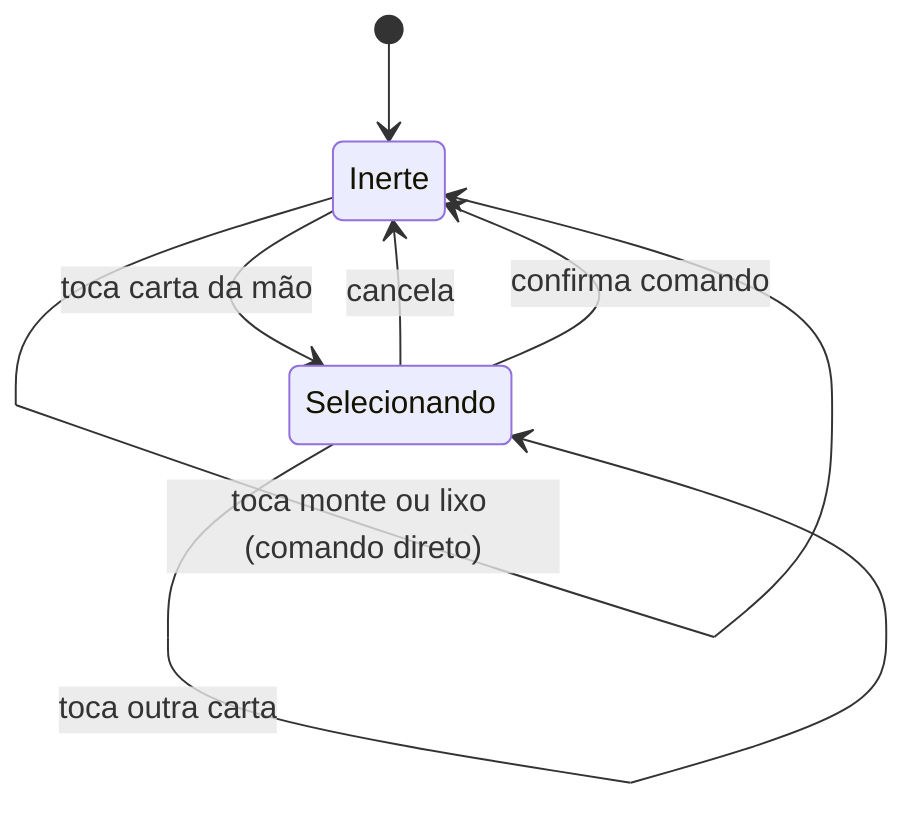

# Telas e interação

> Status: **confirmado** — 11 decisões, nenhuma pendência
> Deriva de: [user-stories.md](user-stories.md) · [requirements.md](requirements.md) · [rules.md](rules.md) · [architecture.md](architecture.md)
> Última atualização: 2026-07-29

## Como ler este documento

Este documento define **estrutura e comportamento** de interface, não aparência. Cores,
tipografia e acabamento ficam para H19, a última história ([user-stories.md](user-stories.md) U3).

O que está aqui: quais telas existem, o que é interativo em cada fase, e como o jogador
expressa cada comando dos seis que a engine aceita.

Pendências: `T1`…`Tn`. Marcação: `[D]` decidido, `[P]` proposto com `⚠️ Tn`.

---

## 1. As quatro telas

| Tela | Propósito | História |
|---|---|---|
| **Inicial** | Uma ação relevante: iniciar partida | H1, RF1.2 |
| **Partida** | Onde o jogo acontece | H1–H14 |
| **Fim de partida** | Vencedor e nova partida | H13, RF1.5 |
| **Regras** | Consulta às regras sem sair do jogo | H17, ADR-0005 |

- `[D]` A **apuração da rodada** (RF4.2, H12) não é tela: é um painel sobreposto
  à tela de partida, que o jogador fecha para seguir para a próxima rodada. A partida
  continua atrás dele, e não há navegação envolvida.

> **Fechado na H13 (S134).** O botão é **um**, e o rótulo é que muda: *"Próxima rodada"* enquanto
> a partida continua, *"Ver o resultado"* quando o placar decidiu. Qual caminho seguir é decisão
> do jogo, não do jogador — dois botões dariam a ele uma escolha que a R12.1 não oferece.

---

## 2. Layout da tela de partida

Adotada a **Opção B — lixo em painel próprio**, e o motivo é uma característica única do
Buraco Aberto.

No Buraco Fechado, o descarte é uma pilha: um retângulo do tamanho de uma carta. No Buraco
**Aberto**, a R4.3 exige que **todas** as cartas do lixo estejam visíveis — e o lixo cresce
durante a rodada. Numa partida em que ninguém o pega, ele passa de 30 cartas.

- `[D]` O lixo ocupa **área própria e dimensionada para crescer**, não um espaço
  dentro da mesa central.

> Na Opção A, o lixo dentro da mesa central obriga a escolher entre duas coisas ruins: ou ele
> tem espaço reservado para 40 cartas e desperdiça a tela inteira no início da rodada, ou ele
> empurra monte e mortos de lugar conforme cresce — e elementos que se movem sozinhos são
> alvos ruins de clique.
>
> Na Opção B ele cresce dentro do próprio painel. Monte, mortos, mão e jogos ficam parados.

- `[D]` O lixo é renderizado em **grade compacta**, na ordem de descarte, do mais
  antigo ao mais recente, com o topo destacado.

> O topo importa mesmo sem a regra de compra justificada (R4.4 dispensou): é a informação de
> qual carta o adversário acabou de largar, o sinal mais recente sobre a mão dele.

### 2.1 A interpretação da R4.3 em telas pequenas

- `[D]` Em telas estreitas, **todas as cartas do lixo continuam renderizadas**,
  em tamanho reduzido, com opção de ampliar. Nenhuma carta fica oculta atrás de interação.

> A R4.3 é sobre **disponibilidade de informação**, não sobre tamanho de renderização. Mostrar
> 30 cartas pequenas cumpre a regra; mostrar "30 cartas — toque para ver" a violaria, porque
> criaria informação que exige ação para obter.
>
> Registro isso como interpretação explícita porque é o tipo de decisão que alguém tomaria por
> conveniência de layout, sem perceber que está mexendo numa regra do jogo.

---

## 3. Onde vive a seleção de cartas

Para baixar, o jogador seleciona várias cartas e confirma. Mas `Partida` **não tem** o
conceito de seleção parcial: ela só representa estados válidos ([domain.md](domain.md) M8).

- `[D]` Existe uma **máquina de estados de interface**, separada da máquina de
  estados do domínio, e ela mora em `ui/`. Nunca em `Partida`, nunca em `estado/`.

O ponto crítico é o que acontece em `Selecionando`:

- `[D]` A interface **nunca valida jogadas**. Ela **filtra** `movimentosValidos`
  pela seleção atual. Uma carta fica selecionável se participa de ao menos um movimento
  válido; o botão de confirmar aparece quando a seleção corresponde exatamente a um.

> T6 é a decisão mais importante deste documento. Sem ela, a interface precisaria saber o que
> é uma sequência válida — e então as regras existiriam em dois lugares, divergindo com o
> tempo. Com ela, a interface é um filtro sobre uma lista que a engine produziu, e a RF2.1
> ("jogada inválida não aparece") sai de graça.

### 3.1 Um problema que T6 cria

Enumerar **todos** os comandos `baixar` válidos pode dar muitas combinações: com a mão inchada
depois de pegar o lixo, cada naipe contribui com todas as sub-sequências de 3 ou mais cartas,
multiplicadas pelas posições possíveis do curinga.

- `[D]` Começamos com **enumeração completa** e **medimos**. Se o custo for alto,
  acrescentamos uma consulta `validar(comando)` usada só pela interface — mas a interface
  **continua sem implementar regra alguma**, apenas troca "me dê todos" por "este vale?".

> A ordem importa: medir antes de otimizar. E o limite é claro — qualquer solução que faça a
> interface decidir o que é válido está fora, por mais rápida que seja.

> **Corrigido em 2026-08-02, ao escrever a [spec 0007](specs/0007-pegar-o-lixo.md) (S81).**
> Este parágrafo dizia *"com 22 cartas na mão depois de pegar o lixo"*. O 22 está certo como
> mão máxima **da distribuição mais um morto** (R9.1) e não tem relação com o lixo: pegá-lo
> passa disso com folga, e a H7 mediu uma mão de **71** cartas.
>
> O número importava aqui mais que em qualquer outro lugar, porque é neste parágrafo que se
> decide **se** a consulta `validar` é necessária. As quatro medições estão no
> [roadmap.md](roadmap.md) §3, e a última — 1738 comandos, o pior caso construível — é a que
> mantém a decisão de pé.

---

## 4. Modelo de interação

- `[D]` A interação primária é **tocar para selecionar e confirmar**, não
  arrastar-e-soltar.

| | Arrastar-e-soltar | Tocar e confirmar |
|---|---|---|
| Desktop | Natural | Funciona bem |
| Celular (RNF3.1) | Impreciso com cartas pequenas | Natural |
| Teclado (RNF3.4) | Praticamente impossível | Direto |
| Selecionar 5 cartas | Cinco arrastes, ou multi-seleção estranha | Cinco toques |

> Um único modelo atende as três plataformas. Arrastar-e-soltar exigiria um segundo caminho
> completo só para teclado — dois caminhos, dois conjuntos de bugs.
>
> Arrastar pode voltar em H19 como **atalho adicional** no desktop, nunca como via única.

---

## 5. O que é interativo em cada fase

Deriva direto da máquina de estados do turno ([domain.md](domain.md) §1.3).

| Fase | Interativo | Inerte |
|---|---|---|
| **Vez do adversário** | Nada | Tudo |
| **Compra** | Monte, lixo | **A mão inteira** |
| **Ação** | Mão, jogos próprios, lixo (como destino de descarte) | Jogos do adversário |

- `[D]` Na fase `Compra`, a mão está **visível e inerte**. Não é possível
  selecionar carta antes de comprar (R3.2).

> Isso é a R3.2 expressa como ausência de afetação, não como mensagem de erro. O jogador não
> descobre a regra levando um "não pode" — descobre porque as cartas não respondem, e o monte
> e o lixo respondem.

A RF2.2 exige indicar **de quem é a vez** e **em que fase**. Com T9, a fase é visível pela
própria interface: se a mão responde, é fase de ação.

---

## 6. Declarar o curinga

A interação mais difícil do jogo (H5). Quando o jogador inclui um 2 na seleção, é preciso
saber **qual carta ele representa**.

- `[D]` A ambiguidade é resolvida pela **própria enumeração da engine**, não por
  lógica de interface:

1. Se a seleção corresponde a **um só** comando `baixar`, o papel do 2 já está determinado —
   nada a perguntar.
2. Se corresponde a **vários** comandos que diferem apenas no papel do 2, a interface mostra
   as opções e o jogador escolhe.
3. Se o 2 está na sua casa natural, ele é carta natural (R1.3) e não há pergunta.

> Exemplo do caso 2: com `5♥ 6♥ 2♠` selecionados, o 2♠ pode fazer papel de 4♥ ou de 7♥. São
> dois comandos distintos em `movimentosValidos`, e a interface só pergunta qual deles.
>
> A interface não sabe o que é uma sequência. Ela sabe contar quantos comandos casam com a
> seleção — e é isso que a mantém livre de regra.

---

## 7. Teclado e telas pequenas

- `[D]` Navegação por teclado (RNF3.4) em **zonas**: `Tab` circula entre mão,
  jogos próprios, monte, lixo e jogos do adversário; setas movem dentro da zona; `Espaço`
  seleciona; `Enter` confirma; `Esc` cancela a seleção.

> A mesma estrutura de zonas organiza o layout em telas estreitas: as zonas empilham em vez de
> se distribuir. E ela é o que torna os testes de interface legíveis — "vá para a zona da mão,
> selecione três cartas, confirme" é uma descrição estável, independente de posição na tela.

Acabamento visual, animações e responsividade fina ficam para H18 e H19.

---

## 8. Histórico das decisões

**Não há pendências.** As 11 decisões foram confirmadas em 2026-07-29.

| # | Assunto | Decisão confirmada |
|---|---|---|
| **T1** | Apuração | Painel sobreposto, não tela |
| **T2** | Layout | **Opção B** — lixo em área própria, dimensionada para crescer |
| **T3** | Lixo | Grade compacta na ordem de descarte, topo destacado |
| **T4** | R4.3 | Em tela estreita, todas as cartas renderizadas menores — nada oculto |
| **T5** | Seleção | Máquina de estados de interface **em `ui/`**, separada do domínio |
| **T6** | Validação | A interface **filtra** `movimentosValidos`; nunca valida |
| **T7** | Desempenho | Enumeração completa primeiro, medir depois; `validar()` só se necessário |
| **T8** | Interação | **Tocar e confirmar**, não arrastar-e-soltar |
| **T9** | Fases | Mão **inerte** na fase de compra (R3.2 como ausência de afetação) |
| **T10** | Curinga | Ambiguidade resolvida pela enumeração, não por lógica de interface |
| **T11** | Teclado | Navegação por zonas: `Tab`, setas, `Espaço`, `Enter`, `Esc` |

### Notas de decisão

- **T6** é a base de tudo: impede que as regras existam em dois lugares. T9 e T10 dependem dela.
- **T4** é uma **interpretação da R4.3**, não só de layout — define que "visível" significa
  disponibilidade de informação, não tamanho de renderização. Referenciada de `rules.md` R4.3.
- **T7** é o único ponto com risco técnico ainda **não medido**. Fica como item a verificar
  durante H4.
